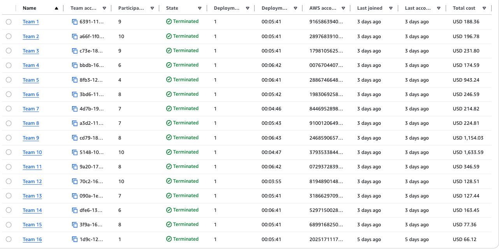

# Tuần 6 — Make It Operational: Tối ưu, Quản trị và Bảo mật kiến trúc của bạn

## Tuần này học gì

Đây là tuần hardening cuối cùng trước capstone W7. Các bạn lấy ứng dụng đã xây qua W1–W5 và biến nó thành production-ready: hạ tầng tự phục hồi, storage tối ưu chi phí, khả năng nhìn thấy chi phí thật bằng tagging và công cụ FinOps, và security tự động sửa các cấu hình sai mà không cần con người can thiệp. Trọng tâm nặng nhất tuần này là **Cost và Optimization** — hai trong bốn Must-Have dành riêng cho việc chứng minh các bạn không chỉ biết tiền chảy đi đâu, mà thực sự đã làm gì đó với sự lãng phí. Mọi thứ các bạn xây tuần này feed thẳng vào demo W7 và câu chuyện phỏng vấn cloud operations của các bạn.

**Cái gì được mang sang từ W1–W5:** Architecture diagram, business domain, các quyết định thiết kế, và code repository của nhóm bạn. Workshop account là mới tinh — redeploy bất cứ thứ gì các bạn cần cho W6. Các bạn KHÔNG phải chứng minh lại mọi feature của tuần trước; điều đó đã làm rồi. Cái trainer kỳ vọng ở Part 1 Thứ Sáu là một project recap ngắn: ứng dụng là gì, business domain của nó, và các quyết định thiết kế chính các bạn mang sang từ W1–W5 — đủ để set context cho phần việc W6. Không cần live app action và không cần cập nhật diagram ở Part 1. Sau đó việc chấm điểm W6 tập trung vào 4 Must-Have dưới đây.

Tuần này được tổ chức quanh **4 Must-Have (MH)** — và hai trong số đó là về cost:
- **MH-COST-V** — Cost Visibility & Attribution (tagging strategy + cost allocation tags được activate + một cost tool + baseline breakdown)
- **MH-COST-A** — Cost Control & Action (Automated Cost Guard: một scheduled Lambda thực sự dừng billable compute không tag, cộng Budgets → SNS → Lambda và một latency ADR)
- **MH-OBS** — Monitoring and Observability (CloudWatch dashboards, alarms, Log Insights)
- **MH-SEC** — Self-Healing Security Guard (một Lambda + EventBridge phát hiện một cấu hình sai về security và tự sửa nó, cộng một preventive control hỗ trợ)

> **Bonus tùy chọn — Optimization Actions:** Muốn đi xa hơn? Migration gp2→gp3, remediation Trusted Advisor dạng config-based (≥2 finding), một phân tích break-even RI/SP, và một bài reflection ngắn "wasteful → changed" đều được tính bonus. Chúng KHÔNG còn là Must-Have bắt buộc — nhưng đây đúng là loại optimization story làm mạnh thêm demo W7 và phần phỏng vấn của các bạn.

> **⚠️ HARD COST CAP — USD $150 cho cả tuần.** Tổng chi tiêu AWS account của nhóm bạn cho W6 phải ở mức bằng hoặc dưới $150. Nếu tổng account vượt $150, **toàn bộ bài tập W6 fail** cho cả nhóm — không ngoại lệ, kể cả khi cả bốn Must-Have đều hoàn hảo. Tuần trước một nhóm để tài nguyên idle và đốt hơn một nghìn đô; đó là lý do cap này tồn tại. Một stack workshop 3-tier hoàn chỉnh không bao giờ cần tới gần $150. Đọc **W6 Cost Discipline Memo** (chia sẻ kèm project announcement) trước khi deploy bất cứ thứ gì — nó chỉ chính xác cách giữ dưới ngưỡng: Single-AZ, instance nhỏ nhất chạy được, serverless khi có thể, tắt qua đêm, và không Bedrock Provisioned Throughput / không OpenSearch multi-node / không EKS. Giữ ≤ $150 và chứng minh các bạn chủ động chọn resource rẻ hơn **chính là** một phần của MH-COST-V — đây không phải việc làm thêm chồng lên bài tập.

---

## Trọng tâm theo ngày

### Thứ Hai — High Availability, Auto Scaling & Tối ưu Cost/Performance

**Nội dung chính**: EC2 Auto Scaling Groups (ASG), ALB health checks, tối ưu S3 storage class, tinh chỉnh cost và performance của EBS, Cloud Economics

**Bắt buộc thực hành**: Cả hai lab SimuLearn (Auto-Healing và Highly Available Web Applications) và cả hai course EBS. Với các course EBS, apply việc học trực tiếp — nhìn vào volume type RDS và EC2 thực tế của các bạn và cân nhắc migrate từ gp2 sang gp3. Migration này là **bonus tùy chọn** tuần này, không phải Must-Have bắt buộc: nếu các bạn làm, document volume ID, old type, new IOPS setting, new throughput setting, và cost comparison để lấy điểm bonus.

**Khái niệm phải nắm (đọc + thảo luận)**: Cloud Economics SimuLearn — đây là một bài tập phân tích, không phải lab deploy gì đó. Làm qua phần phân tích RI vs Savings Plans vs Spot theo nhóm; một decision rationale break-even RI/SP là **bonus tùy chọn** tuần này.

**Cần đặc biệt chú ý**:
- Đặt ALB health check type thành "ELB" trên ASG của bạn, không chỉ "EC2." Type EC2 chỉ bắt được lỗi hypervisor. Type ELB bắt được lỗi ở tầng application — nếu app crash nhưng VM vẫn chạy, chỉ có ELB health check mới thay instance.
- gp3 IOPS configurable độc lập với volume size — một volume gp3 100 GB được đảm bảo 3,000 IOPS và có thể đẩy lên 10,000 IOPS bằng cách đổi một setting, không cần downtime. gp2 không làm được vậy (gp2 buộc IOPS theo volume size dùng hệ thống burst credit). Với gần như mọi workload sinh viên, gp3 là lựa chọn đúng.

**Mẹo thực hành**: Sau các course EBS, check volume type RDS và EC2 thực tế của bạn trong AWS console. Nếu muốn lấy bonus, migrate gp2 sang gp3 và document: volume ID, old type, new IOPS setting, new throughput setting, cost comparison. Screenshot trước/sau — capture trạng thái before khi vẫn còn ở gp2. Đây là bằng chứng bonus gp2→gp3 tùy chọn của bạn.

**Bài tập về nhà (tối Thứ Hai)**: Đọc "Optimize Your Cloud Governance: Balance Security and Cost" — tập trung Module 3 (Config for Cost) và Module 4 (Tagging). Hai module này feed thẳng vào deliverable MH-COST-V của bạn. Module 2 (Organizations/SCPs/RCPs) là phần đọc bối cảnh — các bạn sẽ KHÔNG phải nộp SCP hay Tag Policy JSON tuần này. Module 5 (Security-Cost Balance) giúp bạn viết câu justification trade-off 1–2 câu trong phần MH-SEC. Sáng Thứ Ba có thảo luận nhanh: "Một cost-vs-security trade-off mà nhóm bạn đang cân nhắc là gì?"

---

### Thứ Ba — Cost Audit, Governance & Nền tảng Observability

**Nội dung chính**: Automated Cost Guard (MH-COST-A — xây hôm nay), AWS Systems Manager (củng cố), Amazon CloudWatch (nền tảng MH-OBS), cost-aware governance (tagging + công cụ FinOps), công cụ FinOps, AWS Trusted Advisor (bonus tùy chọn)

**Bắt buộc thực hành**:
- **Automated Cost Guard (MH-COST-A — bắt buộc, xây hôm nay)**: Xây tấm lưới an toàn lẽ ra đã chặn được account chạy lố của tuần trước. Wire một EventBridge Scheduler (hoặc daily cron) → Lambda tìm và DỪNG billable compute (EC2/RDS) không được tag `keep=true`. Cấp cho Lambda một role least-privilege (chỉ các action EC2/RDS describe + stop nó cần — không wildcard). Chứng minh nó thực sự tắt được một thứ gì đó: để một instance không tag chạy, cho Lambda fire theo lịch, và capture event CloudTrail `StopInstances`/`StopDBInstance` với trạng thái before/after. Sau đó wire AWS Budgets (ngưỡng daily $150) → SNS → cùng Lambda đó, và demo đường đó bằng một test SNS publish. Viết một latency ADR ngắn: dữ liệu chi phí AWS trễ ~8–24h, nên trong account 48 giờ trigger cost thật từ Budgets có thể sẽ không fire — điều đó là dự kiến và không bị trừ điểm; cái BỊ trừ điểm là thiếu cơ chế scheduled, không demo được việc dừng, hoặc thiếu ADR. Cái được tính điểm: một resource thực sự bị automation của bạn tắt — không phải một notification.
- **CloudWatch (MH-OBS)**: Cài CloudWatch Agent, lấy được một memory metric xuất hiện trong namespace `CWAgent`, và bắt đầu xây dashboard. Làm hôm nay — nếu đợi tới Thứ Tư, các bạn sẽ không có dữ liệu memory lịch sử nào trước buổi walkabout Thứ Năm.
- **CFM FinOps courses (MH-COST-V)**: Mở Cost Explorer và filter theo CostCenter tag của bạn. Xác định top-3 cost driver và ghi chú một quan sát baseline cost breakdown. Đặt một Budgets threshold alert. Giữ toàn bộ việc này trong cap $150.
- **Trusted Advisor (bonus tùy chọn)**: Nếu muốn lấy bonus, chạy tất cả các check và remediate **ít nhất 2 finding config-based** với bằng chứng before/after (mô tả finding + severity, action bạn đã làm, screenshot after). Nhắm vào các check config-based — đây là những cái thực sự fire trong một account ngắn hạn: unattached EBS volume, unassociated Elastic IP, missing S3 lifecycle rule, public S3 bucket, security group mở `0.0.0.0/0` trên port 22/3389, EBS volume không có snapshot. Các check utilization-based (Low Utilization EC2, Idle RDS, Idle Load Balancer) cần ~14 ngày lịch sử CloudWatch và sẽ KHÔNG fire trong account 48 giờ này, nên đừng xây bằng chứng bonus quanh chúng. "Chúng tôi thấy findings" là không đủ — action mới là cái được tính.

**SSM Lab — củng cố (không phải deliverable W6 được chấm)**: Các bạn đã dùng Session Manager và Parameter Store một cách không chính thức từ các đợt redeploy W3–W5. Lab này đào sâu các kỹ năng đó (Run Command, Automation runbooks, Patch Manager). Tiếp tục áp dụng Session Manager và Parameter Store như một ops hygiene tốt trên stack đã redeploy — nhưng không cần artefact nào từ lab này cho việc chấm điểm W6.

**Khái niệm phải nắm (đọc + thảo luận checkpoint)**: Course governance ("Optimize Your Cloud Governance") là bài đọc của tuần này — KHÔNG phải một buổi lab. Nhóm bạn dùng nó để tạo ra deliverable MH-COST-V:
- Một **tagging strategy document** với ít nhất 4 tag key (Owner, Environment, CostCenter, Application) và các giá trị đã thống nhất với capitalization nhất quán — RỒI activate các tag key đó thành cost allocation tags trong Billing console (Settings > Cost allocation tags). Cả hai bước đều bắt buộc để Cost Explorer group được theo tag của bạn.

(Bonus tùy chọn: một Config rule cho cost compliance, ví dụ "EBS volumes must be gp3" hoặc "EC2 instance types must be in an approved list", là điểm cost-governance thêm — không bắt buộc.)

Câu hỏi checkpoint chiều Thứ Ba là: "Một cost-vs-security trade-off mà nhóm bạn đang làm là gì?" — mang một quan sát thật từ kiến trúc của bạn, không phải câu trả lời sách giáo khoa.

**Cần đặc biệt chú ý**:
- **Cái bẫy tagging hai bước**: Tag một resource là chưa đủ. Bạn còn phải activate tag key đó thành cost allocation tag trong Billing console (Settings > Cost allocation tags). Cho đến khi bước thứ hai này xong, Cost Explorer không group được theo tag của bạn — kể cả khi mọi resource đã được tag hoàn hảo. Làm hôm nay, không phải Thứ Năm.
- CloudWatch KHÔNG thu memory hay disk metrics theo mặc định — bạn phải cài CloudWatch Agent bên trong OS. Nó đẩy dữ liệu vào custom namespace `CWAgent`. Alarms trên metric CWAgent sẽ ở trạng thái INSUFFICIENT_DATA cho tới khi Agent gửi ít nhất một data point.

**Mẹo thực hành**: Đảm bảo Automated Cost Guard (MH-COST-A) của bạn đang fire trước khi rời Thứ Ba — đây là phần bắt buộc duy nhất phải xây hôm nay, và scheduled trigger cần thời gian để fire và tạo ra một CloudTrail Stop event bạn có thể screenshot. Nếu bạn cũng đi đường bonus Trusted Advisor, dùng **finding config-based** (unattached EBS, unassociated EIP, missing S3 lifecycle, public S3, open SG trên 22/3389, EBS không snapshot) — đây là những cái duy nhất nổi lên trong account 48 giờ — và document tên finding, bạn đã đổi gì, và screenshot before/after. Hai finding được document đầy đủ giá trị hơn 12 finding không document.

---

### Thứ Tư — Security Monitoring, KMS & Automated Remediation

**Nội dung chính**: AWS security monitoring stack (CloudTrail, GuardDuty, Config, Security Hub, Detective, Inspector), KMS và envelope encryption, event-driven security remediation với Lambda, environment audit

**Bắt buộc thực hành**: Xây **Self-Healing Security Guard (MH-SEC)** của bạn — đây là phần xây cốt lõi của ngày. KMS lab (tạo một customer managed key, tách admin role và use role trong key policy, mã hóa ít nhất 2 application resource) feed vào supporting control của bạn. Environment Audit lab (IAM Credential Report, S3 public access audit, CloudTrail verification) cho bạn cái cấu hình sai để săn.

**Khái niệm phải nắm (đọc + thảo luận)**: Core Security SimuLearn là một concept walkthrough, không phải lab xây gì đó — dùng nó để review chuỗi security detection (IAM least privilege, CloudTrail logging, GuardDuty findings, các cấu hình sai phổ biến). Course Security Best Practices nói về cách mỗi service kết nối trong chuỗi detection.

**MH-SEC — Self-Healing Security Guard (bắt buộc)**: Phần này tái sử dụng đúng cái pattern bạn đã xây cho MH-COST-A Cost Guard — một Lambda được trigger bởi EventBridge — nhưng thay vì dừng compute không tag, nó phát hiện và tự sửa một cấu hình sai về security.
- **Lambda auto-fix (lõi bắt buộc)**: Một Lambda + EventBridge trigger phát hiện MỘT cấu hình sai về security và sửa nó qua boto3 với một role least-privilege. Chọn một trong:
  - Một Security Group có ingress rule mở (`0.0.0.0/0` trên port 22 hoặc 3389) → Lambda revoke rule đó, HOẶC
  - Một S3 bucket public → Lambda bật Block Public Access trên nó.
- **Chứng minh nó tự lành**: cố ý tạo vi phạm (mở SG / để bucket public), cho Lambda fire, rồi capture screenshot before/after VÀ event CloudTrail cho fix API call (`RevokeSecurityGroupIngress` hoặc `PutPublicAccessBlock`). Event CloudTrail chứng minh code của bạn thực sự thực hiện việc sửa mới là cái được tính điểm — không phải chỉ "Lambda tồn tại."
- **CỘNG một preventive control hỗ trợ**, chọn một trong:
  - S3 account-level Block Public Access được bật + một bucket policy deny truy cập không mã hóa hoặc non-TLS, HOẶC
  - Một KMS Customer Managed Key (CMK) với key rotation được bật, dùng để mã hóa một data store, HOẶC
  - IAM Access Analyzer được bật với ít nhất một finding đã triage (review + resolve hoặc justify).
- **CỘNG một câu security-cost statement 1–2 câu**: giải thích trade-off security-vs-cost bạn đã chọn (ví dụ vì sao bạn chọn cái detection/fix này và supporting control này trong cap $150).
- Bạn KHÔNG cần AWS Config (recorder hay managed rule), SSM Automation document, hay một AutomationAssumeRole cho MH-SEC. (Nếu bạn thích dùng một Config managed rule chỉ làm trigger *detection* feed vào Lambda của bạn thì đó là một alternative chấp nhận được — nhưng nó tùy chọn, không bắt buộc.)

**Cần đặc biệt chú ý**:
- KMS KHÔNG trực tiếp mã hóa dữ liệu ứng dụng của bạn. Nó tạo ra một data key mà code của bạn dùng để mã hóa local, rồi lưu một bản copy của data key đó ở dạng đã mã hóa (cạnh ciphertext của bạn). Khi cần giải mã, bạn gửi data key đã mã hóa cho KMS và nhận lại plaintext key. KMS không bao giờ thấy dữ liệu thật của bạn. Nếu bạn xóa một KMS key, mọi thứ đã mã hóa bằng nó vĩnh viễn không khôi phục được.
- Khác biệt giữa AWS-managed key (`aws/s3`) và Customer Managed Key (CMK): AWS-managed key do AWS kiểm soát — bạn không set được key policy hay rotate theo ý. CMK là cái bạn tạo, nơi bạn quyết định ai là KeyAdministrators và KeyUsers, và bạn bật được automatic rotation. Nếu bạn dùng supporting control KMS, chỉ một CMK với rotation được bật mới chứng minh được bạn thực sự kiểm soát encryption.
- Cấp cho Lambda auto-fix một role least-privilege — chỉ các action describe/revoke hoặc put-public-access-block cụ thể nó cần, không wildcard. Đây là cùng kỷ luật như role của Cost Guard.

**Mẹo thực hành**: Chạy heal loop end-to-end — cố ý tạo vi phạm, xem Lambda fire, xác nhận cấu hình sai đã biến mất, và lấy event CloudTrail cho fix call cộng screenshot before/after. Event CloudTrail của Lambda sửa vấn đề mới là cái tách câu chuyện "chúng tôi phát hiện được" khỏi câu chuyện "nó tự lành".

---

### Thứ Năm — Review và chốt bài

Dùng Thứ Năm để đóng các gap từ Mon–Wed và chốt cả 4 deliverable MH trước Thứ Sáu.

**Buổi sáng**: trainer review top những hiểu nhầm phổ biến từ checkpoint, sau đó hoạt động củng cố nhóm được tổ chức quanh 4 Must-Have:

1. **Cost Visibility (MH-COST-V)**: Tạo tagging strategy document của bạn (4+ key, giá trị và capitalization đã thống nhất). Xác nhận cost allocation tags đã được activate trong Billing console (Settings > Cost allocation tags — screenshot cả strategy doc lẫn xác nhận activation). Mở Cost Explorer filter theo CostCenter tag của bạn và xác định top-3 cost driver. Viết một quan sát baseline cost breakdown ngắn. Trainer sẽ check tagging doc và activation trong Billing console trong lúc walkabout.

2. **Cost Control & Action (MH-COST-A)**: Xác nhận Automated Cost Guard của bạn hoạt động: show event CloudTrail `StopInstances`/`StopDBInstance` chứng minh scheduled Lambda (với role least-privilege của nó) đã tắt một resource không tag, cộng phần Budgets ($150 daily) → SNS → Lambda được demo bằng một test SNS publish, và latency ADR. Trainer sẽ tìm một resource thực sự bị automation dừng trong lúc walkabout — một notification mà không dừng gì là không đạt.

   **Bonus tùy chọn — Optimization Actions**: Nếu bạn đi đường bonus, chốt bảng TA findings config-based của bạn (ít nhất 2 với bằng chứng before/after), tài liệu migration gp2→gp3 (volume ID, IOPS setting, throughput setting, cost comparison), phân tích break-even RI/SP hoặc justified deferral, và một bài reflection 100–150 từ "wasteful → changed" (bạn tìm thấy gì, bạn đổi gì, tác động là gì).

3. **CloudWatch Observability (MH-OBS)**: Xác nhận dashboard của bạn có ít nhất 3 widget có ý nghĩa (1 metric tầng API, 1 metric tầng data, 1 metric CWAgent). Xác nhận ít nhất một alarm ở trạng thái OK — nếu bất kỳ alarm nào ở INSUFFICIENT_DATA, điều tra và sửa ngay. Lưu một Log Insights query với screenshot kết quả.

4. **Self-Healing Security Guard (MH-SEC)**: Xác nhận Lambda auto-fix của bạn thực sự đã tự lành vi phạm — show trạng thái before (SG mở / bucket public), trạng thái after (rule đã revoke / Block Public Access đã bật), và event CloudTrail cho fix API call. Xác nhận preventive control hỗ trợ đã sẵn sàng (S3 BPA + bucket policy deny không mã hóa/non-TLS, HOẶC một KMS CMK với rotation, HOẶC IAM Access Analyzer với một finding đã triage). Viết câu security-cost statement 1–2 câu của bạn.

**Buổi chiều**: Chốt Evidence Pack của bạn (`docs/W6_evidence.md`). Mỗi mục cần screenshot kèm 1–2 dòng giải thích cấu hình — screenshot thô không có context không tính vào ngưỡng score-4. Cả 4 mục MH phải có mặt.

Nộp architecture diagram cập nhật và link Evidence Pack vào kênh Slack trainer trước 17:00.

---

### Thứ Sáu — Show What You Know

Các nhóm 9–15 thuyết trình nội dung W6 tuần này. Các nhóm 1–8 thuyết trình Thứ Sáu tuần sau.

Mỗi nhóm thuyết trình ~10–12 phút theo bốn phần:
1. **Project Recap (~1.5 phút)**: nói/slide recap ngắn về project — ứng dụng là gì, business domain của nó, và các quyết định kiến trúc và thiết kế chính mang sang từ W1–W5 — để frame phần việc operational W6. Không cần cập nhật diagram và không cần live app action ở đây. Nếu các bạn có xử lý feedback W5 nào, nhắc qua ngắn gọn — tùy chọn, không phải gate được chấm.
2. **W6 Architecture (~3 phút)**: đi qua cả 4 phần bổ sung MH theo thứ tự:
   - Tầng Cost Visibility (MH-COST-V): tagging strategy + cost allocation tag activation + Cost Explorer top-3 cost driver view + quan sát baseline cost breakdown
   - Tầng Cost Control (MH-COST-A): Automated Cost Guard — scheduled Lambda (role least-privilege) dừng compute không tag, chứng minh qua CloudTrail Stop event; Budgets $150 → SNS → Lambda + latency ADR
   - Tầng Monitoring (MH-OBS): CloudWatch dashboard + alarm ở trạng thái OK + kết quả Log Insights query
   - Tầng Security (MH-SEC): Self-Healing Security Guard — Lambda + EventBridge đã tự sửa một cấu hình sai (before/after + event CloudTrail fix) + preventive control hỗ trợ + câu security-cost statement 1–2 câu
   - Bonus tùy chọn, nếu đã làm: TA findings config-based với before/after + dữ liệu migration gp2→gp3 + phân tích/deferral RI/SP + bài reflection "wasteful → changed"
3. **Individual QnA (~3 phút)**: 2–3 thành viên được gọi tên — bất kỳ thành viên nào cũng có thể bị chọn. Chuẩn bị cả team, không chỉ người đã xây từng phần
4. **Live Demo (~3–4 phút)**: ASG auto-healing, Self-Healing Security Guard sửa một cấu hình sai (before/after + event CloudTrail fix), tagging strategy + bằng chứng cost allocation tag activation, Cost Explorer filter theo tag, Automated Cost Guard dừng một resource không tag (CloudTrail Stop event), preventive control hỗ trợ của bạn. Nếu bạn làm bonus: EBS volume settings (type, IOPS, throughput) và TA findings config-based với before/after

Post commit link `docs/W6_evidence.md` vào kênh Slack trainer trước slot của bạn. Không có link = Criterion IV cap ở 3.

---

## Deliverables tuần này

Nhóm bạn phải nộp đến Thứ Sáu — và tổng AWS account phải giữ **≤ $150** cho cả tuần (vượt = fail toàn bộ bài tập W6; xem W6 Cost Discipline Memo):

1. **MH-COST-V — Cost Visibility & Attribution**:
   - Tagging strategy document với ít nhất 4 tag key đã thống nhất (Owner, Environment, CostCenter, Application), giá trị đã thống nhất, và quy ước capitalization
   - Cost allocation tags được activate trong Billing console (screenshot cho thấy activation trong Settings > Cost allocation tags — đây là bước hầu hết các nhóm bỏ lỡ)
   - Ít nhất 1 công cụ cost visibility được dùng: Cost Explorer filter theo tag cho thấy top-3 cost driver, HOẶC Budgets alert đã cấu hình, HOẶC Cost Anomaly Detection đã bật
   - Strategy doc 1 trang tóm tắt các quyết định cost governance của bạn cho lần deploy này
   - Screenshot baseline cost breakdown với quan sát top-3 cost driver được ghi chú
   - Tổng account giữ ≤ $150 với bằng chứng các bạn chủ động chọn resource rẻ hơn (Single-AZ, instance nhỏ nhất chạy được, serverless, tắt qua đêm) — đây là một phần của MH-COST-V, không phải việc làm thêm

2. **MH-COST-A — Cost Control & Action** (Automated Cost Guard):
   - Một EventBridge Scheduler/daily-cron → Lambda dừng billable compute (EC2/RDS) không được tag `keep=true`, với một execution role least-privilege (chỉ các action describe/stop nó cần)
   - Chứng minh được là tắt một resource: một resource để chạy, rồi bị scheduled Lambda dừng, capture thành event CloudTrail `StopInstances`/`StopDBInstance` với trạng thái before/after
   - AWS Budgets (daily $150) → SNS → cùng Lambda đó, được demo qua một test SNS publish
   - Một latency ADR ngắn (dữ liệu chi phí trễ ~8–24h nên trigger cost thật có thể không fire trong account 48h — dự kiến, không bị trừ điểm; thiếu cơ chế scheduled, không demo được việc dừng, hoặc thiếu ADR là không chấp nhận được)
   - Chấm theo một resource thực sự bị automation tắt, không phải một notification

3. **MH-OBS — CloudWatch Observability**:
   - Dashboard với ít nhất 3 metric có ý nghĩa (một tầng API, một tầng data, một metric CloudWatch Agent từ namespace `CWAgent`)
   - Ít nhất một alarm được cấu hình và ở trạng thái OK
   - Log Insights query đã lưu với screenshot kết quả

4. **MH-SEC — Self-Healing Security Guard**:
   - Một Lambda + EventBridge trigger (cùng pattern với MH-COST-A Cost Guard) phát hiện MỘT cấu hình sai về security và tự sửa nó qua boto3, với một execution role least-privilege — khuyến nghị: một Security Group mở `0.0.0.0/0` trên port 22/3389 → revoke rule đó, HOẶC một S3 bucket public → bật Block Public Access
   - Demo end-to-end: cố ý tạo vi phạm, Lambda sửa nó, capture thành screenshot before/after CỘNG event CloudTrail cho fix API call (ví dụ `RevokeSecurityGroupIngress` / `PutPublicAccessBlock`)
   - Một preventive control hỗ trợ: S3 account-level Block Public Access + một bucket policy deny không mã hóa/non-TLS, HOẶC một KMS CMK với rotation được bật trên một data store, HOẶC IAM Access Analyzer được bật với ít nhất một finding đã triage
   - Câu security-cost statement 1–2 câu: trade-off security-vs-cost bạn đã chọn và vì sao nó hợp với project bạn trong cap $150
   - GuardDuty và CloudTrail được bật
   - AWS Config recorder / managed rule / SSM Automation / AutomationAssumeRole KHÔNG bắt buộc (một Config managed rule chỉ có thể được dùng tùy chọn làm trigger detection feed vào Lambda của bạn)

5. **Evidence Pack** (`docs/W6_evidence.md`): Cover (group ID, repo link, link W5 Evidence Pack), MH-COST-V, MH-COST-A, MH-OBS, MH-SEC, Project Recap (một recap viết tay ngắn — ứng dụng là gì, business domain của nó, và các quyết định thiết kế chính mang sang từ W1–W5), Bonus (tùy chọn). Screenshot kèm note cấu hình 1–2 dòng cho mỗi mục. Slide link tới commit hash. Không có Evidence Pack = điểm cap ở 2. Screenshot không có note = cap ở 3.

**Bonus tùy chọn — Optimization Actions** (không bắt buộc; làm mạnh thêm demo W7 và câu chuyện phỏng vấn của bạn):
- Bảng Trusted Advisor findings: ít nhất 2 finding **config-based** thực sự đã remediate (before state, action taken, after state — screenshot từng stage). Dùng check config-based (unattached EBS, unassociated EIP, missing S3 lifecycle, public S3, open SG trên 22/3389, EBS không snapshot) — TA findings config-based fire trong 48h; loại utilization-based thì không
- Migration gp2→gp3: volume ID, old type, new IOPS setting, new throughput setting, cost comparison (cho từng volume đã migrate)
- Phân tích break-even RI/SP: một quyết định có document hoặc một justified deferral viết tay
- Bài reflection 100–150 từ "wasteful → changed": bạn tìm thấy gì lãng phí, bạn đổi gì, kết quả là gì?

**Bonus (+0.25)**: Mở rộng Self-Healing Security Guard để phát hiện và tự sửa một cấu hình sai THỨ HAI khác biệt (ví dụ nó xử lý cả một Security Group mở lẫn một S3 bucket public), với bằng chứng before/after + CloudTrail cho fix thứ hai luôn.

---

## Cách chấm điểm

- **Group Architecture (20%)**: Cả 4 phần bổ sung MH có được cấu hình đúng và đặt đúng vị trí trong diagram của bạn không? Team có defend được các lựa chọn — Automated Cost Guard quyết định dừng cái gì và vì sao role của nó là least-privilege, tagging strategy của bạn enforce cái gì, Self-Healing Security Guard của bạn sửa cấu hình sai về security nào và bạn chọn supporting control nào và vì sao?
- **Individual QnA (30%)**: Khả năng giải thích Automated Cost Guard hoạt động end-to-end (schedule → Lambda → tag check → stop, cộng đường Budgets → SNS và vì sao trigger cost thật trễ), quy trình tagging hai bước + cost allocation tag activation, Self-Healing Security Guard phát hiện và sửa cấu hình sai của nó thế nào (và vì sao role của nó là least-privilege), và KMS envelope encryption — khi bị gọi. Mọi thành viên đều có thể bị chọn.
- **Deployment and Evidence (40%)**: Phần nặng nhất. Chấm theo Evidence Pack của bạn từng mục.
  - Điểm 4 yêu cầu: tổng account ≤ $150; cả 4 mục MH có screenshot và note; tagging strategy với bằng chứng cost allocation tag activation và quan sát baseline cost breakdown; Automated Cost Guard với một resource thực sự bị scheduled Lambda least-privilege dừng (CloudTrail Stop event) cộng Budgets $150 → SNS → Lambda được demo và latency ADR; CloudWatch dashboard với metric CWAgent; alarm ở trạng thái OK; Log Insights query đã lưu; Self-Healing Security Guard đã tự sửa một cấu hình sai với before/after và event CloudTrail fix, cộng một preventive control hỗ trợ; slide link tới Evidence Pack
  - Điểm 5 yêu cầu tất cả những trên CỘNG một trong: auto-healing event trong CloudWatch Activity Log với timestamps, Self-Healing Security Guard sửa một cấu hình sai THỨ HAI khác biệt (before/after + event CloudTrail fix), hoặc một Optimization Actions bonus hoàn chỉnh (TA finding config-based với before/after remediation, lý tưởng là cost impact được lượng hóa)
- **Project Recap (10%)**: Một recap gọn, chính xác về project — ứng dụng là gì, business domain của nó, và các quyết định thiết kế chính mang sang từ W1–W5 — frame rõ phần việc operational W6. Chấm thuần theo độ rõ ràng và chính xác của recap; không cần cập nhật diagram hay live app action. Nhắc cụ thể feedback W5 là một bonus, không phải yêu cầu.
- **Daily checkpoints**: Kahoot game Thứ Hai đến Thứ Tư tính vào điểm.

---

## Pro Tips

- **Theo dõi cap $150 từ Day 1.** Đặt một Budgets alert ngay lập tức, mặc định Single-AZ và instance nhỏ nhất chạy được, ưu tiên serverless, và tắt compute qua đêm. Vượt $150 fail toàn bộ bài tập W6 bất kể Must-Have của bạn tốt thế nào — đọc W6 Cost Discipline Memo trước khi deploy.
- **Xây Automated Cost Guard sớm vào Thứ Ba, không phải muộn.** Scheduled trigger cần thời gian để thực sự fire để bạn capture được một CloudTrail Stop event trước Thứ Sáu. Cấp cho Lambda một role least-privilege (chỉ các action EC2/RDS describe/stop — không wildcard), và tự chấm mình theo một resource thực sự bị tắt, không phải theo một notification. Đừng kỳ vọng trigger cost thật từ Budgets fire trong 48h — đó là lý do latency ADR tồn tại.
- **Cái bẫy tagging hai bước là lỗi MH-COST-V phổ biến nhất.** Tag resource VÀ activate cost allocation tags trong Billing console trong cùng session Thứ Hai hoặc Thứ Ba. Đừng đợi tới Thứ Năm mới phát hiện Cost Explorer đã mù với tag của bạn cả tuần.
- **MH-SEC là một Self-Healing Security Guard — phát hiện mà không sửa là không đủ.** Xây nó như một Lambda + EventBridge, cùng pattern với Cost Guard của bạn. Lỗi phổ biến nhất tuần này là các nhóm phát hiện được cấu hình sai nhưng không bao giờ capture được event CloudTrail chứng minh Lambda của họ thực sự đã sửa nó. Cố ý tạo vi phạm để bạn có một before/after sạch.
- **Cài CloudWatch Agent Thứ Hai hoặc Thứ Ba.** Nếu bạn đợi tới Thứ Tư, bạn sẽ không có memory hay disk metrics lịch sử nào trong dashboard trước buổi walkabout Thứ Năm — và alarms trên metric `CWAgent` sẽ kẹt ở INSUFFICIENT_DATA.
- **Mọi người cần hiểu Automated Cost Guard và Self-Healing Security Guard.** Đây là hai chủ đề khả năng cao nhất trong individual QnA, và chúng chia sẻ cùng pattern Lambda + EventBridge. Luyện giải thích: (1) schedule trigger Cost Guard Lambda thế nào, nó quyết định dừng cái gì từ tag `keep=true` thế nào, vì sao role là least-privilege, và vì sao trigger cost thật trễ; (2) EventBridge trigger của Security Guard fire Lambda thế nào, Lambda phát hiện cấu hình sai và sửa nó qua boto3 thế nào, và vì sao role của nó là least-privilege.
- **Đi đường Optimization bonus? Capture before state vào Thứ Hai.** Document một before state gp2→gp3 yêu cầu volume của bạn vẫn còn ở gp2 (volume ID, size, IOPS baseline, cost per GB-month). TA findings config-based fire trong 48h; loại utilization-based thì không — hai remediation được document đầy đủ giá trị hơn 12 finding không document.

---

## AWS Services trọng tâm tuần này

| Service | Làm gì | Vì sao quan trọng cho project |
|---------|--------|-------------------------------|
| EC2 Auto Scaling (ASG) | Tự động thêm/bớt instance theo demand; thay instance unhealthy | Giữ app chạy dưới tải và sau khi lỗi — xương sống compute cho load testing W7 |
| Application Load Balancer | Phân phối traffic qua các AZ; chạy health check | Tầng traffic HA — health check type phải là "ELB" để thay instance theo nhận biết application |
| Amazon EBS gp3 | Block storage với IOPS (tới 16,000) và throughput configurable độc lập | Right-size storage database và app cho performance thật ở chi phí thấp hơn gp2 — migration gp2→gp3 là một bonus tùy chọn tuần này |
| AWS Trusted Advisor | Automated best-practice check qua 5 trụ cột (cost, performance, security, fault tolerance, service limits) | Công cụ bonus tùy chọn. Trong account 48h, nhắm finding **config-based** (unattached EBS, unassociated EIP, missing S3 lifecycle, public S3, open SG trên 22/3389, EBS không snapshot) — remediate ≥2 với before/after. Finding config-based fire trong 48h; check utilization cần ~14 ngày và sẽ không. |
| AWS Lambda + EventBridge | Chạy code theo lịch hoặc phản hồi event; gọi AWS API qua boto3 | Cấp năng lượng cho CẢ MH-COST-A (Automated Cost Guard dừng EC2/RDS không tag, chứng minh bằng CloudTrail Stop event) và MH-SEC (Self-Healing Security Guard phát hiện và sửa một cấu hình sai, chứng minh bằng CloudTrail fix event) — cùng pattern, role least-privilege cả hai lần |
| Amazon CloudWatch + Agent | Metrics, alarms, dashboards, log queries; Agent thêm memory và disk từ bên trong OS | Nền tảng MH-OBS — không có Agent, memory và disk vô hình với CloudWatch |
| AWS Cost Explorer | Trực quan hóa chi phí theo service, account, và tag theo thời gian | Công cụ lõi MH-COST-V — yêu cầu cost allocation tag activation trong Billing console trước khi group được theo tag của bạn |
| AWS Budgets | Cost và usage threshold alert | MH-COST-V threshold alert + trigger MH-COST-A (daily $150 → SNS → Cost Guard Lambda) |
| Amazon S3 Block Public Access | Switch ở mức account và bucket chặn truy cập public; ghép với một bucket policy deny không mã hóa/non-TLS | MH-SEC — mục tiêu auto-fix khuyến nghị (bucket public → Lambda bật BPA) và một lựa chọn preventive control hỗ trợ |
| AWS KMS (CMK) | Quản lý encryption key bạn tạo và kiểm soát; key policy tách admin khỏi use; hỗ trợ automatic rotation | Lựa chọn preventive control hỗ trợ MH-SEC — một CMK với rotation được bật trên một data store. Chỉ một CMK (không phải AWS-managed key) mới chứng minh bạn kiểm soát encryption. |
| AWS IAM Access Analyzer | Xác định resource được share ra ngoài account/zone of trust của bạn | Lựa chọn preventive control hỗ trợ MH-SEC — bật nó và triage ít nhất một finding |
| AWS Config (tùy chọn) | Ghi lại lịch sử cấu hình resource; đánh giá compliance rule | KHÔNG bắt buộc cho MH-SEC. Tùy chọn chỉ làm trigger detection feed vào Lambda Self-Healing Security Guard của bạn — không phải deliverable. |
