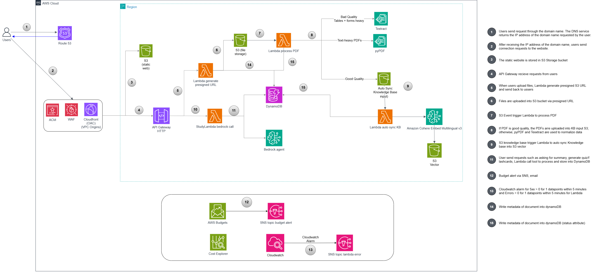
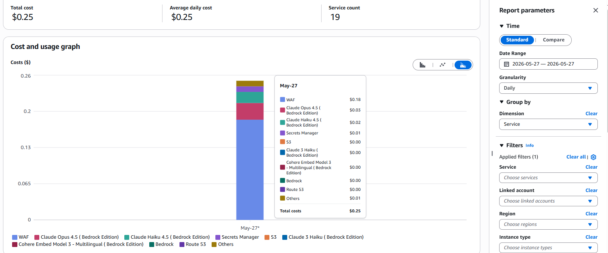
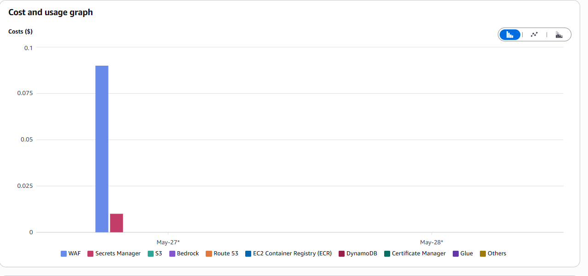
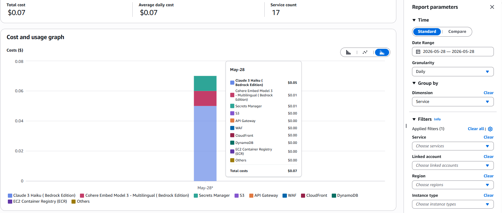
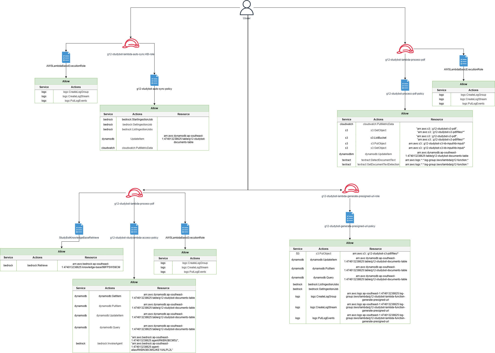
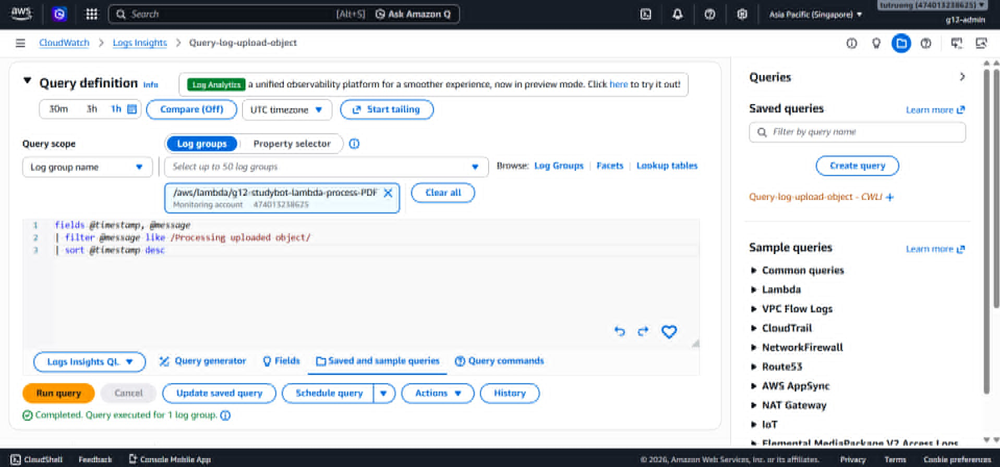
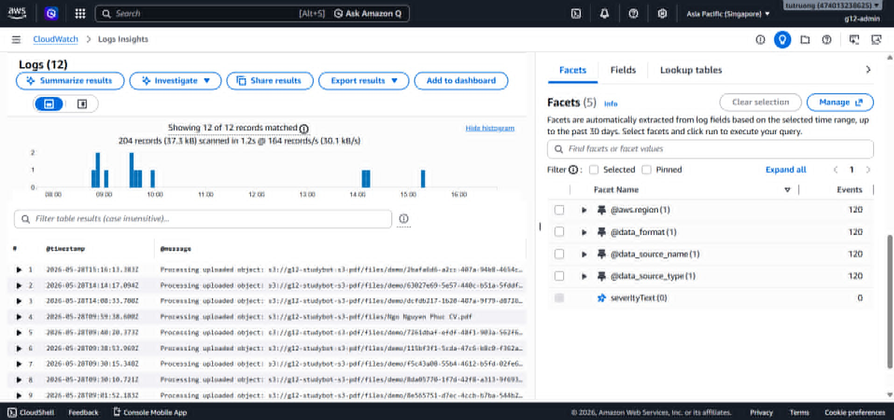

# Week 7 - Evidence Pack

- [Project Group 12](https://github.com/truongcongtu318/xbrain-learners-group12)
- [Evidence Pack](#evidence-pack)
- [Live URL](https://truongtudev.id.vn/)
- [Section 1 - Cover](#section-1-cover)
- [Section 2 - Pitch and Vision](#section-2-pitch-and-vision)
- [Section 3 - Architecture](#section-3-architecture)
- [Section 4 - Cost Deployment](#section-4-cost-deployment)
- [Section 5 - Security](#section-5-security)
- [Section 6 - Monitoring](#section-6-monitoring)
- [Section 6.5 - Measurement & Decisions](#section-65-measurement--decisions)
- [Section 7 - Lesson Learned](#section-7-lesson-learned)
- [Section 8 - Teardown Plan](#section-8-teardown-plan)


# Section 1. Cover

- Group number: 12
- Member names
  - Ngô Nguyên Phúc
  - Huỳnh Nguyễn Ngọc Tân
  - Tạ Hoàng Huy
  - Trương Công Tú
  - Trần Quang Minh
  - Nguyễn Minh Hoàng
  - Lý Ngọc Hiếu
  - Nguyễn Vũ Hoàng
  - Võ Văn Tuấn Anh
  - Nguyễn Trúc Quỳnh

# Section 2. Pitch and Vision

- **Product Name**: StudyBot (AI Study Buddy)
- **Tagline**: Upload lecture slides. Get a study guide, content summary, flashcard set, and quiz in seconds.
- **Target Audience**: University students, self-learners, and exam-prep candidates facing overwhelming amounts of lecture slides and study materials.
- **Problem Statement**: Students often struggle to extract key concepts from bulky lecture slide decks (which contain tables, multi-column layouts, and figures). It is difficult for students to practice with questions which can be appeared in the exam with direct citations back to the source slides.
- **Value Proposition**: StudyBot uses an intelligent AWS-powered RAG (Retrieval-Augmented Generation) engine to process slide decks, extract structured knowledge, and provide instant summaries, slide-cited Q&A, and auto-generated quizzes/ flashcards. It saves dozens of study hours while grounding every answer in the actual course slides to prevent hallucinations.

# Section 3. Architecture



StudyBot is designed with full serverless architecture, cost efficiency, and modularity. The architecture implements the 7 mandatory capabilities:

1. **User-Facing Entry (Capability #1)**: 
   - **Frontend Serving**: Amazon CloudFront serving a responsive static Web UI from an Amazon S3 bucket. HTTPS is enabled using CloudFront and custom domain `truongtudev.id.vn` (zero configuration cost).
   - **API Entry**: Amazon API Gateway (HTTP API) serving as the edge router, forwarding clients' requests securely to our backend compute.
2. **Application Compute (Capability #2)**:
   - **Compute Layer**: AWS Lambda running Python 3.14, handling incoming POST `/upload`, and `/study` endpoints and GET `/documents`. Compute is completely stateless, scaling automatically to handle concurrent student queries.
3. **AI / ML Feature (Capability #3)**:
   - **Bedrock Knowledge Bases**: Used to orchestrate the entire RAG pipeline. Document chunking, vector generation, and vector index retrieval are abstracted via Bedrock KBs.
   - **Foundation Model**: Amazon Bedrock utilizing `claude haiku 4.5` for fast, highly accurate, and cost-effective text generation.
   - **Embeddings Model**: `cohere.embed-english-v3` for highly accurate vector representations with 1024 dimensions and chunking size of 300 tokens.
4. **Data Persistence (Capability #4)**:
   - **Session & User State**: Amazon DynamoDB storing user session histories, generated flashcards, and student quiz scores. Features on-demand scaling for zero base cost.
5. **Object Storage (Capability #5)**:
   - **Document Storage**: Amazon S3 bucket for storing raw uploaded lecture slides PDF format. Scoped with lifecycle rules.
     - The bucket is scoped with lifecycle rules to reduce storage cost after ingestion.
     - Objects remain in S3 Standard during the active ingestion window to ensure Bedrock Knowledge Base can re-sync the source documents when needed.
     - After the documents are successfully ingested, older objects transition to S3 Glacier Flexible Retrieval for long-term cost optimization.
     - This life cycle keeps the RAG system up to date through the Knowledge Base while still preserving the original lecture in cost-optimization class.
6. **Network Foundation (Capability #6)**:
   - The architecture is fully serverless, so VPC, subnets, NAT Gateway, and Security Groups are not necessary.
   - API Gateway provides the backend APIs over HTTPS, while Lambda handles compute logic in a managed runtime.
   - S3 and CloudFront are used for document storage and frontend delivery.
   - Access between services is controlled mainly through IAM roles and resource.
7. **Identity & Access Baseline (Capability #7)**:
   - **IAM Security**: Execution roles apply strict least-privilege policies. Lambda can only write to specific DynamoDB tables, invoke specific Bedrock models, and access the designated S3 bucket.

# Section 4. Cost Deployment

Our architecture is optimized to stay well under the **$100 cap**. By choosing Serverless compute (Lambda), on-demand DynamoDB, and free Gateway endpoints, we successfully avoided high fixed-cost infrastructure (like NAT Gateways or active EC2 instances).

## 4.1 Cost Discipline (ap-southeast-1 Singapore Pricing)

### Cost screenshots (Day 1 EOD / Day 2 EOD / Friday pre-demo)
#### End of day 1


#### End of day 2


#### Morning demo day



### Breakdown by service
| Service | Calculation & Usage | Deployed Cost ($) |
|---------|---------------------|-------------------|
| **AWS Lambda** | `[Insert actual number]` invocations | `$ [Insert actual cost]` |
| **API Gateway HTTP** | `[Insert actual number]` requests | `$ [Insert actual cost]` |
| **Bedrock Claude 4.5 Haiku** | `[Insert actual input/output tokens]` | `$ [Insert actual cost]` |
| **Bedrock Embeddings** | Ingestion of `[Insert actual number]` documents | `$ [Insert actual cost]` |
| **Vector Database (S3 Vectors)** | `[Insert actual vector usage details]` | `$ [Insert actual cost]` |
| **DynamoDB** | `[Insert actual write/read capacity units consumed]` | `$ [Insert actual cost]` |
| **Amazon S3** | `[Insert actual storage size and request counts]` | `$ [Insert actual cost]` |
| **CloudFront** | Outbound data transfer | `$ [Insert actual cost]` |
| **Total Spend** | **For the 48-hour build and demo window** | **`$ [Insert total cost]`** |

## 4.2 Cost Discipline Strategy

- **Development Model Choice**: We strictly used `Claude 4.5 Haiku` ($1.00/M input, $5.00/M output) during the development and debugging loops instead of `Claude 3.5 Sonnet` ($3.00/M input, $15.00/M output), saving significant developer budget.
- **Budget Alerts**: Deployed an AWS Budget at $100 with an email notification threshold set at **$80 (80%)** via SNS. Cost Anomaly Detection was turned on immediately.
- **Tagging Strategy**: Applied `Project=W7Capstone`, `Team=G12`, `Owner=<who create service in the G12>`, and `Environment=hackathon` tags to all resources for precise tracking in Cost Explorer.

# Section 5. Security

We hardened our StudyBuddy application by targeting **Advanced Security (Capability #10)**:

1. **Least-Privilege IAM Roles**:
   - The backend Lambda execution role has no wildcard `*` actions. It is scoped to specific resources and actions.
   - The following diagram shows the IAM role for each Lambda to be able ensure the least privilege principle
      
2. **Data Encryption at Rest & in Transit**:
   - **At Rest**: Utilized SSE-S3 to encrypt the raw document S3 bucket.
   - **In Transit**: All API requests and frontend distributions are served strictly over **TLS 1.2 / TLS 1.3** via CloudFront and HTTPS API Gateway.

# Section 6. Monitoring

We implemented **Full Observability (Capability #8)** to track application health:

- **CloudWatch Dashboard**: A centralized dashboard tracking Lambda duration, invocations, error rates, throttles,  and API Gateway 5xx and 4xx errors.
  - Dashboard shared URL: [Live URL](https://cloudwatch.amazonaws.com/dashboard.html?dashboard=g12-studybot-dashboard&context=eyJSIjoidXMtZWFzdC0xIiwiRCI6ImN3LWRiLTQ3NDAxMzIzODYyNSIsIlUiOiJ1cy1lYXN0LTFfVVNiaFRVVVRjIiwiQyI6IjIwM3ZlNW0zdXRpZ2dva2RsYnN1ZDMwOGRkIiwiSSI6InVzLWVhc3QtMTpjYjM1ZGIyNi02ZTc4LTQzMTEtOTBjOS02OTNhYTMyMjVlYTEiLCJPIjoiYXJuOmF3czppYW06OjQ3NDAxMzIzODYyNTpyb2xlL3NlcnZpY2Utcm9sZS9DV0RCU2hhcmluZy1QdWJsaWNSZWFkT25seUFjY2Vzcy05WElQNDQ0RyIsIk0iOiJQdWJsaWMifQ%3D%3D&start=PT12H&end=null&fbclid=IwY2xjawSFyOJleHRuA2FlbQIxMABicmlkETFQNlNHQTJPZkdQRlZ2aDdIc3J0YwZhcHBfaWQQMjIyMDM5MTc4ODIwMDg5MgABHpbG33ZDoZumC_m3K5lO7fUENBzK63VMR4ZRad6h_qSpl32sYiJrfJieARuk_aem_57L2P3tmlpBqq3MuD6H4yg)
- **Custom Metric**: Published custom metric for `StudyBot` each time a student successfully uploads a document including: `DocumentsProcessed`, `GoodQualityPDF`, `TextractFallbackPages`, `TotalPagesProcessed`
- **CloudWatch Alarms**: Configured a CloudWatch Alarm on Lambda `Errors` metric (5xx and 4xx status code) that sends an immediate email alert via AWS SNS
- **Saved Log Insights Queries**: Built and saved queries to filter for `Processing uploaded objects` strings in the Lambda log streams for easy live triage:
  ```sql
   fields @timestamp, @message
   | filter @message like /Processing uploaded object/
   | sort @timestamp desc
  ```
  
  

# Section 6.5. Measurement & Decisions

## 6.5.1 Use AWS Lambda outside VPC
```
   DECISION: Use AWS Lambda outside VPC for document upload processing, Knowledge Base auto sync, S3 presigned URL generating, and study chatbot because the architecture is fully serverless and only communicates with managed AWS services such as S3, API Gateway, DynamoDB, CloudWatch, and Bedrock.

   ALTERNATIVES CONSIDERED:
      - Lambda inside VPC with private subnets and communicate via VPC endpoints gateway and interface - eliminated because there is no private RDS, EC2, or internal service that Lambda needs to access. 
      - ECS Fargate inside VPC - eliminated because the document processing workload, the auto sync Knowledge base, S3 presigned URL generating, and study chatbot are event driven and they are not required to run continously 24/7. Running these service in a long time can increase costs compared to Lambda.

   MEASUREMENT:
      - Lambda cold start and execution time for S3-triggered document processing = 1.0–1.5 seconds - measured from CloudWatch logs.
      - While the current design requires no NAT Gateway, NAT Gateway cost avoided = approximately $0.059 per hour or $0.059 per GB data processed before data processing cost

   EVIDENCE:
      - docs/images/W7-architect.png - The architecture with Lambda without VPC attached.
      - docs/images/cold-start.png - The cold start time is approximately 1 second as measured and claimed 
      - docs/images/W7-architect.png - The architecture with Lambda without VPC attached, so there is no need for NAT gateway

   TRADE-OFF ACCEPTED:
      - Lambda cannot directly access private resources such as RDS, EC2 in a private subnet. This is acceptable because the current system uses managed serverless services and IAM-based access instead of private network access.
```

## 6.5.2 Use Hybrid text extraction strategy
```
   DECISION: Use Hybrid text extraction strategy. For documents flagged as good quality, the document is copied to kb-input bucket. For documents flagged as bad quality, implement a page-by-page hybrid loop that defaults to use pypdf text extraction, but switches to use AWS Textract (detect_document_text) for those specific pages if the extracted word count is less than 15 words (len(pypdf_text.split()) < 15). Then, they are saved as md file and store in kb-input bucket.

   ALTERNATIVES CONSIDERED:
      - Textract everywhere - eliminated because Textract costs $0.0015/page × 200 pages/day = $0.30/day. Even in low quality documents, many pages still have only text. Running Textract for all pages of a 40-slide document when only 10 pages are images would waste ~$0.045 per file.
      - pypdf everywhere - eliminated because if a page is a pure scanned image or include many tables, pypdf cannot read tables-as-images. Using pypdf for all documents can cause loss of important image-based or table-based data.

   MEASUREMENT:
      - Cost reduction per 40-Page Slide lecture with 10 Textract fallback pages: Saved around 75% on OCR fees ($0.015 spent on 10 pages vs. $0.060 for Textract-everywhere).
      - Processing time reduction for good quality document with around 1600ms by completely bypassing the page iteration loop.
      
   EVIDENCE:
      - docs/images/good-quality.png - If the document is good quality, it copied to the kb-input bucket for syncing.
      - docs/images/TextractFallbackPages.png - If the document is bad quality and contains many images, figures or tables, Textract is used to extract information. CloudWatch metric TextractFallbackPages successfully tracking intermittent OCR triggers on sub-sections of single document uploads.

   TRADE-OFF ACCEPTED:
      - The hybrid strategy takes longer than executing a single extraction method (pypdf or Textract exclusively). It is acceptable since the output is clean and structured Markdown data optimized for downstream Knowledge Base chunking and vector syncing. 
      - Because the Lambda process PDF function runs on an asynchronous S3 Event Trigger, processing in the background and does not impact on front-end responsiveness or the immediate user experience.

```


# Section 7. Lesson Learned
## What went well

The serverless architecture meet the project's requirements and goals'. S3, Lambda, API Gateway, CloudFront, and Bedrock Knowledge Base are used to build a document intelligence system without managing servers, VPCs, or complex networking. The flow upload to knowledge base was also clear with the flow: lecture PDFs are stored in S3, processed and stored into kb-input S3 bucket, then synced into Bedrock Knowledge Base, and used for RAG-based answers. 

## What I would do differently if we had more time:

- *Add a visible ingestion status workflow*: The current upload flow works, but the user experience can be unclear while the document is being processed and synced into the Knowledge Base. With more time, we would store a document status lifecycle in DynamoDB, such as UPLOADED -> PROCESSING -> SYNCING_TO_KB -> READY -> FAILED, and show that progress in the frontend.
- *Improve document quality validation before ingestion*: We would add stronger checks for scanned PDFs, empty slides, image-heavy pages, and unsupported files before sending documents into the RAG pipeline. This would reduce bad chunks in the Knowledge Base and make answers more reliable.
- *Strengthen retry and recovery logic*: If a Knowledge Base sync job or Textract fallback fails, the system should retry safely and expose the failure reason to the team instead of requiring manual CloudWatch log inspection.

## One concrete failure mode identified:

- Low-quality or scanned lecture slides can produce very little text when extracted with pypdf. If those pages contain important content as images or tables, the Knowledge Base receives incomplete context. As a result, the chatbot may still answer general questions, but it can miss slide-specific details or return weaker citations. The mitigation we would prioritize is the hybrid fallback described in Section 6.5: run OCR with AWS Textract only on pages where pypdf extracts fewer than 15 words. The trade-off is higher processing time and extra per-page Textract cost.


# Section 8. Teardown Plan

To eliminate all services deployed in Hackathon to ensure zero continuing personal AWS costs after the hackathon, we will execute the following teardown plan:  

1. **Delete Amazon Bedrock and S3 Vector Storage**: Delete the Knowledge Base sync configuration, vector indices, and empty the target S3 Vector bucket. 
2. **Empty & Delete S3 Buckets**: S3 buckets cannot be deleted while containing files. We will empty all uploaded student slides and frontend build files from our S3 buckets, then delete the buckets.
3. **Delete DynamoDB Tables**: Delete the Document State and Metadata table
4. **Delete Compute and API Layers**: Delete AWS Lambda backend functions (4 functions), Lambda layers, and the API Gateway HTTP API.
5. **Disable CDN**: Disable and delete the CloudFront distribution, AWS WAF ACLs, and Route 53 DNS records pointing to the app.
6. **Clean Up IAM**: Delete IAM roles created for the hackathon.
7. **Monitoring and Governance**: Delete CloudWatch Alarms such as Lambda error alarms, SNS Topics, and custom metric definitions under DocumentPipeline.
8. **Verification**: Take a Cost Explorer screenshot to confirm daily spend drops to exactly $0.00.